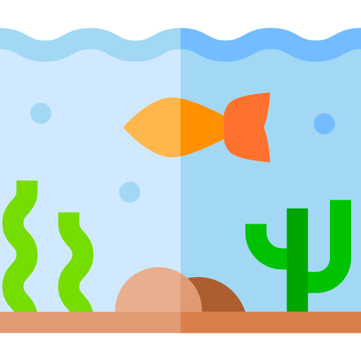

# Pond

[](https://github.com/marcransome/pond/actions) [](https://github.com/marcransome/pond/issues) [](https://github.com/marcransome/pond/network/dependencies) [](http://opensource.org/licenses/mit-license.php) [](https://fishshell.com)

Pond is a shell environment manager for the [fish shell](https://fishshell.com).

<hr>

Group related functions together into named _ponds_ and expose them to the shell environment using `load`, `unload`, `enable`, or `disable` commands. Use special `autoload` and `autounload` functions to set or unset environment variables when ponds are loaded or unloaded.

## Background

Pond started life as a small idea: to group related shell environment variables and functions into named collections (_ponds_) and to provide a simple mechanism for controlling when those collections are loaded into the shell environment. It does this by leveraging [autoloaded functions](https://fishshell.com/docs/current/index.html#autoloading-functions) as a means of encapsulating environment configuration and provides a simple set of subcommands to manage such configuration.

## Installation

Install with [Fisher](https://github.com/jorgebucaran/fisher):

```console
$ fisher install marcransome/pond
```

Or with [Oh My Fish](https://github.com/oh-my-fish/oh-my-fish):

```console
$ omf install https://github.com/marcransome/pond
```

Or with [plug.fish](https://github.com/kidonng/plug.fish):

```console
$ plug install marcransome/pond
```

### Creating ponds

Create an empty pond using the `create` command:

```console
$ pond create my_app
```

Ponds are _enabled_ by default, meaning any functions that are added will automatically be made available in new shell sessions. To disable this behaviour set the universal variable `pond_enable_on_create` to `no`:

```console
$ set -U pond_enable_on_create no
```

### Adding functions to a pond

Move to the pond directory for which you wish to add a function:

```console
$ pond dir my_app
```

Add one or more related functions to the pond directory. For example:

```
$ vi start_my_app.fish
...
```

Provide a suitable function definition:

```fish
function start_my_app
  ...
end
```

### Enabling ponds

Use the `enable` command to make functions belonging to a pond accessible to new shell sessions:

```console
$ pond enable my_app
Enabled pond: my_app
```

### Disabling ponds

Use the `disable` command to make functions belonging to a pond inaccessible to new shell sessions:

```console
$ pond disable my_app
Disabled pond: my_app
```

### Loading ponds

Use the `load` command to make pond functions available in the current shell session:

```console
$ pond load my_app
Loaded pond: my_app
```

### Unloading ponds

Use the `unload` command to remove pond functions from the current shell session:

```console
$ pond unload my_app
Unloaded pond: my_app
```

### Autoload functions

A pond may include an optional _autoload_ function which is automatically executed in the current shell whenever the pond is loaded using the `load` command. If a pond is enabled then its autoload function, if present, will be executed automatically in each new shell that is created. Autoload functions are the recommended way of exporting shell variables for a pond.

To create or edit an existing autoload function for a pond and open it in an interactive editor:

```console
$ pond autoload my_app
```

Populate the autoload function with environment variables as required:

```fish
function my_app_autoload
    set -xg MY_APP_ADDR localhost
    set -xg MY_APP_PORT 9999
end
```

### Autounload functions

A pond may include an optional _autounload_ function which is automatically executed in the current shell whenever the pond is unloaded using the `unload` command. Autoload functions are the recommended way of erasing shell variables for a pond that were previously set using an _autoload_ function.

To create or edit an existing autounload function for a pond and open it in an interactive editor:

```console
$ pond autounload my_app
```

Populate the autounload function with the required cleanup commands:

```fish
function my_app_autounload
    set -e MY_APP_ADDR
    set -e MY_APP_PORT
end
```

This function is automatically executed if a pond is unloaded.

### Viewing global status

Use the `status` command without arguments to view the global status of all ponds:

```console
$ pond status
● pond 2.2.0
     Health: good
      Ponds: 1 (1 enabled; 1 loaded)
     Loaded: /root/.config/fish/pond
             └─• my_app
```

### Viewing pond status

Use the `status` command to view the status of a pond:

```console
$ pond status my-app
● my_app (/root/.config/fish/pond/my_app)
     Status: loaded, enabled
     Health: good
   Autoload: present
 Autounload: absent
  Functions: 1
       Size: 8.0K
```

### Listing ponds

Use the `list` command to list all available ponds:

```console
$ pond list
my_app
```

Use one or more filter options to limit the output:

```console
$ pond list --enabled
my_app
```

### Removing ponds

Use the `remove` command to remove a pond:

```console
$ pond remove my_app
Remove pond: my_app? y
Removed pond: my_app
```

To automatically accept the confirmation prompt use the `-y` or `--yes` option:

```console
$ pond remove --yes my_app
Removed pond: my_app
```

### Draining ponds

Use the `drain` command to drain all functions from a pond:

```console
$ pond drain my_app
Drain pond: my_app? y
Drained pond: my_app
```

To automatically accept the confirmation prompt use the `-y` or `--yes` option:

```console
$ pond drain --yes my_app
Drained pond: my_app
```

### Viewing global configuration

To view global configuration settings for `pond`:

```console
$ pond config
Pond home: /Users/<username>/.config/fish/pond
Enable ponds on creation: yes
Pond editor command: /usr/local/bin/vim
```

### Opening a pond directory

To open a pond directory:

```console
$ pond dir my_app
```

The current working directory will be changed to the pond directory.

## Additional documentation

Only a small subset of operations is documented here. Additional documentation is provided through usage output when `pond` is invoked with no arguments, or by invoking it with the `--help` option. Use `pond <command> --help` for details of a specific command.

An optional man page is provided and discussed in more detail below.

### Installing the man page

The `pond(1)` man page is provided separately from the plugin installation for `pond` itself. To install the _latest_ version of the man page:

Using `fish`:

```console
$ curl https://raw.githubusercontent.com/marcransome/pond/main/manpages/install.fish | fish
```

Or, using `bash`:

```console
$ bash -c "$(curl https://raw.githubusercontent.com/marcransome/pond/main/manpages/install.sh)"
```

To install the man page corresponding to a specific version of `pond`, replace the branch name `main` in the above URLs with the semantic version number (use `pond --version` to obtain the version string).

### Viewing the man page online

As an alternative to installing the man page, [view the latest version of the man page online](http://htmlpreview.github.io/?https://github.com/marcransome/pond/blob/main/manpages/pond.html).

## Event handlers

Pond emits events for many successful operations. Setup an [event handler](https://fishshell.com/docs/current/index.html#event) to repond to such events with your own code:

Event name      | Description                     | Arguments
--------------- | --------------------------------| ----------------------------------------------
`pond_created`  | Emitted when a pond is created  | `argv[1]`: pond name<br />`argv[2]`: pond path
`pond_removed`  | Emitted when a pond is removed  | `argv[1]`: pond name<br />`argv[2]`: pond path
`pond_enabled`  | Emitted when a pond is enabled  | `argv[1]`: pond name<br />`argv[2]`: pond path
`pond_disabled` | Emitted when a pond is disabled | `argv[1]`: pond name<br />`argv[2]`: pond path
`pond_loaded`   | Emitted when a pond is loaded   | `argv[1]`: pond name<br />`argv[2]`: pond path
`pond_unloaded` | Emitted when a pond is unloaded | `argv[1]`: pond name<br />`argv[2]`: pond path
`pond_drained`  | Emitted when a pond is drained  | `argv[1]`: pond name<br />`argv[2]`: pond path

For example, to write the name of each new pond created to a file:

```console
function pond_create_handler --on-event pond_created --argument-names pond_name pond_path
  echo "$pond_name was created at $pond_path on "(date) >> ~/my-ponds
end
```

## Acknowledgements

* Icons made by [Freepik](https://www.freepik.com) from [www.flaticon.com](https://www.flaticon.com/)
* Pond's [workflow](https://github.com/marcransome/pond/actions) uses the [fishtape](https://github.com/jorgebucaran/fishtape) test runner and [tap-diff](https://github.com/axross/tap-diff) to make things pretty

## License

Pond is provided under the terms of the [MIT License](http://opensource.org/licenses/mit-license.php).

## Contact

Email me at [marc.ransome@fidgetbox.co.uk](mailto:marc.ransome@fidgetbox.co.uk) or tweet [@marcransome](http://www.twitter.com/marcransome).
